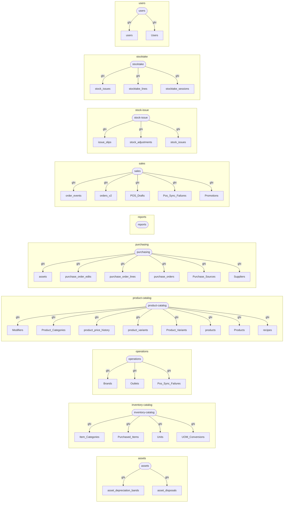

# Architecture diagram (generated)

Do not edit by hand. Regenerate with `vite-node scripts/system-map/generate-diagram.ts`.

```mermaid
flowchart LR
  subgraph assets["assets"]
    flow_assets(["assets"])
    assets__asset_depreciation_bands["asset_depreciation_bands"]
    assets__asset_disposals["asset_disposals"]
  end
  flow_assets -->|ghi| assets__asset_depreciation_bands
  flow_assets -->|ghi| assets__asset_disposals
  subgraph inventory_catalog["inventory-catalog"]
    flow_inventory_catalog(["inventory-catalog"])
    inventory_catalog__Item_Categories["Item_Categories"]
    inventory_catalog__Purchased_Items["Purchased_Items"]
    inventory_catalog__Units["Units"]
    inventory_catalog__UOM_Conversions["UOM_Conversions"]
  end
  flow_inventory_catalog -->|ghi| inventory_catalog__Item_Categories
  flow_inventory_catalog -->|ghi| inventory_catalog__Purchased_Items
  flow_inventory_catalog -->|ghi| inventory_catalog__Units
  flow_inventory_catalog -->|ghi| inventory_catalog__UOM_Conversions
  subgraph operations["operations"]
    flow_operations(["operations"])
    operations__Brands["Brands"]
    operations__Outlets["Outlets"]
    operations__Pos_Sync_Failures["Pos_Sync_Failures"]
  end
  flow_operations -->|ghi| operations__Brands
  flow_operations -->|ghi| operations__Outlets
  flow_operations -->|ghi| operations__Pos_Sync_Failures
  subgraph product_catalog["product-catalog"]
    flow_product_catalog(["product-catalog"])
    product_catalog__Modifiers["Modifiers"]
    product_catalog__Product_Categories["Product_Categories"]
    product_catalog__product_price_history["product_price_history"]
    product_catalog__product_variants["product_variants"]
    product_catalog__Product_Variants["Product_Variants"]
    product_catalog__products["products"]
    product_catalog__Products["Products"]
    product_catalog__recipes["recipes"]
  end
  flow_product_catalog -->|ghi| product_catalog__Modifiers
  flow_product_catalog -->|ghi| product_catalog__Product_Categories
  flow_product_catalog -->|ghi| product_catalog__product_price_history
  flow_product_catalog -->|ghi| product_catalog__product_variants
  flow_product_catalog -->|ghi| product_catalog__Product_Variants
  flow_product_catalog -->|ghi| product_catalog__products
  flow_product_catalog -->|ghi| product_catalog__Products
  flow_product_catalog -->|ghi| product_catalog__recipes
  subgraph purchasing["purchasing"]
    flow_purchasing(["purchasing"])
    purchasing__assets["assets"]
    purchasing__purchase_order_edits["purchase_order_edits"]
    purchasing__purchase_order_lines["purchase_order_lines"]
    purchasing__purchase_orders["purchase_orders"]
    purchasing__Purchase_Sources["Purchase_Sources"]
    purchasing__Suppliers["Suppliers"]
  end
  flow_purchasing -->|ghi| purchasing__assets
  flow_purchasing -->|ghi| purchasing__purchase_order_edits
  flow_purchasing -->|ghi| purchasing__purchase_order_lines
  flow_purchasing -->|ghi| purchasing__purchase_orders
  flow_purchasing -->|ghi| purchasing__Purchase_Sources
  flow_purchasing -->|ghi| purchasing__Suppliers
  subgraph reports["reports"]
    flow_reports(["reports"])
  end
  subgraph sales["sales"]
    flow_sales(["sales"])
    sales__order_events["order_events"]
    sales__orders_v2["orders_v2"]
    sales__POS_Drafts["POS_Drafts"]
    sales__Pos_Sync_Failures["Pos_Sync_Failures"]
    sales__Promotions["Promotions"]
  end
  flow_sales -->|ghi| sales__order_events
  flow_sales -->|ghi| sales__orders_v2
  flow_sales -->|ghi| sales__POS_Drafts
  flow_sales -->|ghi| sales__Pos_Sync_Failures
  flow_sales -->|ghi| sales__Promotions
  subgraph stock_issue["stock-issue"]
    flow_stock_issue(["stock-issue"])
    stock_issue__issue_slips["issue_slips"]
    stock_issue__stock_adjustments["stock_adjustments"]
    stock_issue__stock_issues["stock_issues"]
  end
  flow_stock_issue -->|ghi| stock_issue__issue_slips
  flow_stock_issue -->|ghi| stock_issue__stock_adjustments
  flow_stock_issue -->|ghi| stock_issue__stock_issues
  subgraph stocktake["stocktake"]
    flow_stocktake(["stocktake"])
    stocktake__stock_issues["stock_issues"]
    stocktake__stocktake_lines["stocktake_lines"]
    stocktake__stocktake_sessions["stocktake_sessions"]
  end
  flow_stocktake -->|ghi| stocktake__stock_issues
  flow_stocktake -->|ghi| stocktake__stocktake_lines
  flow_stocktake -->|ghi| stocktake__stocktake_sessions
  subgraph users["users"]
    flow_users(["users"])
    users__users["users"]
    users__Users["Users"]
  end
  flow_users -->|ghi| users__users
  flow_users -->|ghi| users__Users
```
